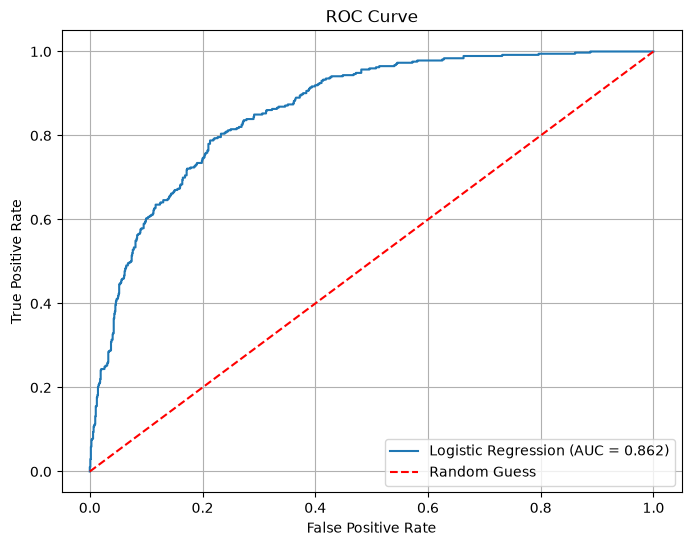
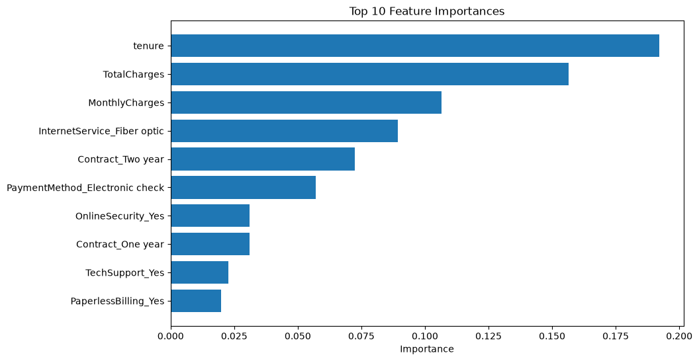

# 📊 Customer Churn Prediction using Machine Learning


## 📖 Project Overview

Customer churn is one of the biggest challenges faced by subscription-based businesses such as telecom companies. Retaining an existing customer is significantly cheaper than acquiring a new one.

This project develops an end-to-end machine learning pipeline to predict whether a telecom customer is likely to churn based on customer demographics, account information, internet services, billing details, and contract type.

The project covers the complete machine learning lifecycle:

- Data Cleaning
- Exploratory Data Analysis (EDA)
- Feature Engineering
- Model Building
- Model Evaluation
- Business Insights

---

# 🎯 Problem Statement

The objective of this project is to predict customer churn so that telecom companies can proactively identify customers at risk and implement targeted retention strategies.

---

# 📂 Dataset

**Dataset:** Telco Customer Churn Dataset

**Source:** Kaggle

### Dataset Summary

| Property | Value |
|----------|-------|
| Records | 7043 |
| Features | 21 |
| Target Variable | Churn |

---

# 🛠 Technologies Used

- Python
- Pandas
- NumPy
- Matplotlib
- Seaborn
- Scikit-learn
- Imbalanced-learn (SMOTE)
- Jupyter Notebook
- Git & GitHub

---

# ⚙ Project Workflow

```
Raw Dataset
      │
      ▼
Data Cleaning
      │
      ▼
Exploratory Data Analysis
      │
      ▼
Feature Engineering
      │
      ▼
One-Hot Encoding
      │
      ▼
Train-Test Split
      │
      ▼
Feature Scaling
      │
      ▼
Model Training
      │
      ├── Logistic Regression
      ├── Logistic Regression + SMOTE
      ├── Random Forest
      └── Tuned Random Forest
      │
      ▼
Model Evaluation
      │
      ▼
Business Insights
```

---

# 🧹 Data Cleaning

## TotalCharges

### Issue

- Stored as **object** instead of numeric.
- 11 rows contained blank values.

### Investigation

All affected customers had:

- Tenure = 0

### Resolution

- Blank values replaced with **0**
- Converted `TotalCharges` to `float`

---

# 📊 Exploratory Data Analysis

## Target Distribution

| Churn | Percentage |
|--------|-----------:|
| No | 73.46% |
| Yes | 26.54% |

The dataset exhibits moderate class imbalance, which was later addressed using **SMOTE**.

---

# 🔍 Key Business Insights

## 📅 Tenure

| Churn | Average Tenure |
|--------|---------------:|
| No | 37.57 Months |
| Yes | 17.98 Months |

**Insight**

Customers with shorter tenure are significantly more likely to churn.

---

## 💰 Monthly Charges

| Churn | Average Monthly Charges |
|--------|------------------------:|
| No | 61.27 |
| Yes | 74.44 |

**Insight**

Higher monthly charges are associated with increased churn.

---

## 📄 Contract Type

| Contract | Churn Rate |
|-----------|-----------:|
| Month-to-month | 42.71% |
| One year | 11.27% |
| Two year | 2.83% |

**Insight**

Long-term contracts greatly reduce customer churn.

---

## 🌐 Internet Service

| Internet Service | Churn Rate |
|------------------|-----------:|
| DSL | 18.96% |
| Fiber Optic | 41.89% |
| No Internet | 7.40% |

**Insight**

Fiber Optic customers experience substantially higher churn.

---

## 🔒 Online Security

Customers without Online Security churn nearly **three times more frequently** than customers who subscribe to the service.

---

## 🛠 Tech Support

Customers with Tech Support demonstrate significantly lower churn rates.

---

## 💳 Payment Method

Electronic Check customers have the highest churn rate among all payment methods.

---

## 👨‍👩‍👧 Dependents

Customers with dependents are much less likely to churn than customers without dependents.

---

# 📈 Machine Learning Models

The following machine learning models were trained and evaluated.

- Logistic Regression
- Logistic Regression + SMOTE
- Random Forest
- Tuned Random Forest

---

# 📊 Model Performance

| Model | Accuracy | Precision | Recall | F1 Score |
|---------|---------:|----------:|--------:|---------:|
| Logistic Regression | **82.1%** | **0.69** | 0.60 | **0.64** |
| Logistic Regression + SMOTE | 76.0% | 0.52 | **0.83** | 0.64 |
| Random Forest | 78.5% | 0.64 | 0.44 | 0.52 |
| Tuned Random Forest | 81.1% | 0.69 | 0.52 | 0.59 |

---

# 📉 ROC Curve

The Logistic Regression model achieved an **ROC-AUC score of 0.862**, indicating strong discrimination between churning and non-churning customers.



---

# 🌳 Feature Importance

Random Forest identified the following features as the strongest predictors of churn:

1. Tenure
2. Total Charges
3. Monthly Charges
4. Fiber Optic Internet Service
5. Two-Year Contract
6. Electronic Check
7. Online Security
8. Tech Support

These findings strongly align with the insights obtained during exploratory data analysis.



---

# 💼 Business Recommendations

Based on the analysis, telecom companies should:

- Focus retention campaigns on customers with low tenure.
- Encourage customers to switch from month-to-month contracts to long-term contracts.
- Improve service quality for Fiber Optic customers.
- Review pricing strategies for customers with high monthly charges.
- Promote Online Security and Tech Support services.
- Investigate the high churn among Electronic Check users.

---

# 🏆 Final Results

### Best Accuracy

**Logistic Regression**

**82.1%**

---

### Best Recall

**Logistic Regression + SMOTE**

**83%**

---

### Best ROC-AUC

**0.862**

---

### Most Important Feature

**Tenure**

---

# 📝 Conclusion

Four machine learning models were evaluated to predict telecom customer churn.

The baseline Logistic Regression model achieved the highest overall accuracy (**82.1%**), while Logistic Regression trained with **SMOTE** significantly improved recall from **60%** to **83%**, making it the preferred model for customer retention campaigns.

The project demonstrates how exploratory data analysis, feature engineering, machine learning, and business interpretation can be combined to build a practical customer churn prediction system.

---

# 🚀 Future Improvements

- Deploy the model using Flask or FastAPI.
- Build a Streamlit dashboard.
- Perform GridSearchCV for hyperparameter optimization.
- Experiment with XGBoost and LightGBM.
- Integrate the model into a CRM platform for real-time churn prediction.

---

# 📂 Project Structure

```
Customer-Churn-Predictor/
│
├── data/
│   └── Telco-Customer-Churn.csv
│
├── notebook/
│   └── churn_analysis.ipynb
│
├── images/
│   ├── churn_distribution.png
│   ├── roc_curve.png
│   ├── feature_importance.png
│
├── requirements.txt
├── README.md
└── .gitignore
```

---

# 🚀 How to Run

Clone the repository

```bash
git clone https://github.com/<your-username>/Customer-Churn-Predictor.git
```

Install dependencies

```bash
pip install -r requirements.txt
```

Launch Jupyter Notebook

```bash
jupyter notebook notebook/churn_analysis.ipynb
```

---

# 👨‍💻 Author

**Himanshu Gobari**

- GitHub: https://github.com/<gobarihimanshu071>
- LinkedIn: https://linkedin.com/in/<www.linkedin.com/in/himanshu-gobari-a60a5724b>

---